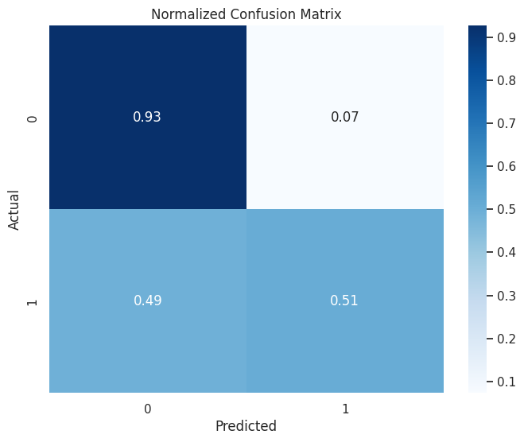
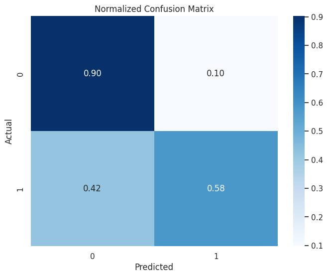
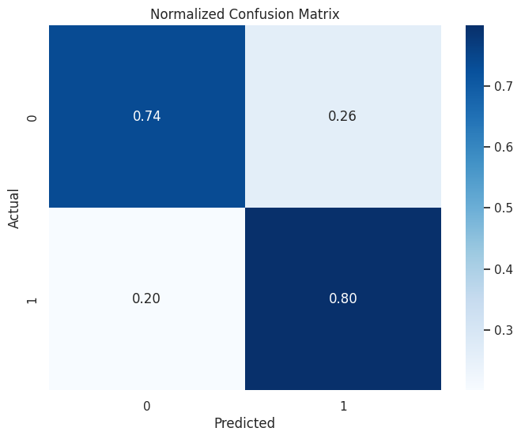
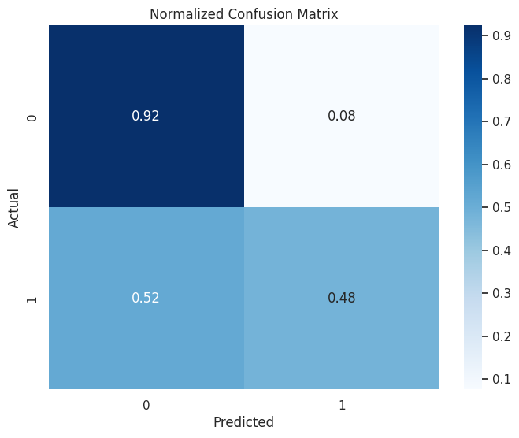
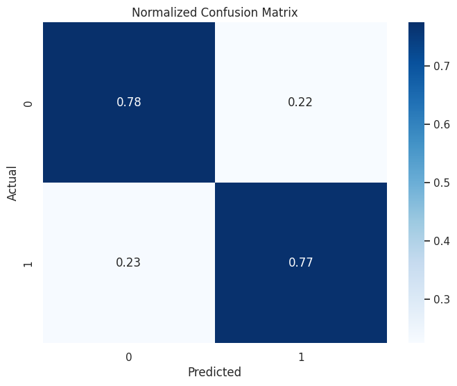

# 🤖SKN03-3rd-1Team : 옵티마이조🤖

👾 팀 소개

|     유혜린     |    박지용    |        송명신         |    정해린    |   진윤화   |
| :------------: | :----------: | :-------------------: | :----------: | :--------: |
|   @Lerini98    |   @J-push    |    @SongMyungshin     |  @junghl11   | @JinYunhwa |
| Project Leader | Manager Page | Front-end & User page | Manager Page |  Modeling  |

⌛ 개발 기간

2024-09-23 ~ 2024-09-24 (총 2일)

## 📌 프로젝트 목표

- 장고를 이용한 화면 개발 (가능하면, 관리자 분석 페이지 개발)

- 가입 고객 이탈 예측과 관련된 화면 개발

- 가입 고객 이탈 예측 모델 개발 및 결과에 대한 설명

## 📌프로젝트 소개

이탈 징후가 보이는 고객군에 대한 맞춤형 제안 서비스 제공

> 이탈 가능성이 높은 고객에게 특정 요금제나 혜택을 제안하여 이탈을 줄이는 방안을 설계

## 📎데이터셋 정보

[통신사 고객 이탈 데이터셋](https://www.kaggle.com/datasets/blastchar/telco-customer-churn)

- 지난 달에 떠난 고객 (Churn 컬럼)

- 각 고객이 가입한 서비스

  - 전화, 다중 회선, 인터넷, 온라인 보안, 온라인 백업, 장치 보호, 기술 지원, TV 및 영화 스트리밍

- 고객 계정 정보

  - 고객이 된 기간, 계약, 지불 방법, 무지불 청구, 월별 요금 및 총 요금

- 고객의 인구 통계 정보
  - 성별, 연령대, 파트너 및 부양가족이 있는지 여부

## Flowchart


# Model

# EDA

```python
import pandas as pd

# data.csv 파일 읽어오기
df = pd.read_csv('../data/data.csv')

# 읽어온 데이터 확인
print(df.head())
```


```python
df.info()
```


## 수치형 데이터 시각화

- 고객 이탈율을 예측하기 위해 다양한 수치형 데이터(Tenure, MonthlyCharges, TotalCharges를 시각화

```python
import seaborn as sns
import matplotlib.pyplot as plt

# Seaborn 스타일 설정
sns.set(style="whitegrid")

# Churn이 Yes일 때 tenure의 빈도수 계산
tenure_counts_churn_yes = df[df['Churn'] == 'Yes']['tenure'].value_counts().sort_index()

# Churn이 No일 때 tenure의 빈도수 계산
tenure_counts_churn_no = df[df['Churn'] == 'No']['tenure'].value_counts().sort_index()

# 그래프 설정
plt.figure(figsize=(10, 6))

# Churn이 Yes일 때 tenure의 빈도수 시각화
sns.lineplot(x=tenure_counts_churn_yes.index, y=tenure_counts_churn_yes.values, marker='', color='red', label='Churn = Yes')

# Churn이 No일 때 tenure의 빈도수 시각화
sns.lineplot(x=tenure_counts_churn_no.index, y=tenure_counts_churn_no.values, marker='', color='blue', label='Churn = No')

# 제목과 축 레이블 설정
plt.title('Frequency of Tenure by Churn Status', fontsize=16)
plt.xlabel('Tenure', fontsize=14)
plt.ylabel('Frequency', fontsize=14)

# 그래프 꾸미기
plt.xticks(fontsize=12)
plt.yticks(fontsize=12)
plt.grid(True, linestyle='--', alpha=0.7)
plt.legend(title='Churn Status', fontsize=12, title_fontsize=14)

# 그래프 출력
plt.show()

```


```python
import seaborn as sns
import matplotlib.pyplot as plt

# Seaborn 스타일 설정
sns.set(style="whitegrid")

# 그래프 설정
plt.figure(figsize=(10, 6))

# Churn이 Yes일 때 TotalCharges의 KDE 시각화
sns.kdeplot(data=df[df['Churn'] == 'Yes'], x='TotalCharges', color='red', label='Churn = Yes', fill=True)

# Churn이 No일 때 TotalCharges의 KDE 시각화
sns.kdeplot(data=df[df['Churn'] == 'No'], x='TotalCharges', color='blue', label='Churn = No', fill=True)

# 제목과 축 레이블 설정
plt.title('Distribution of TotalCharges by Churn Status', fontsize=16)
plt.xlabel('TotalCharges', fontsize=14)
plt.ylabel('Density', fontsize=14)

# 그래프 꾸미기
plt.xticks(fontsize=12)
plt.yticks(fontsize=12)
plt.grid(True, linestyle='--', alpha=0.7)
plt.legend(title='Churn Status', fontsize=12, title_fontsize=14)

# 그래프 출력
plt.show()

```


```python
import seaborn as sns
import matplotlib.pyplot as plt

# Seaborn 스타일 설정
sns.set(style="whitegrid")

# 그래프 설정
plt.figure(figsize=(10, 6))

# Churn이 Yes일 때 MonthlyCharges의 KDE 시각화
sns.kdeplot(data=df[df['Churn'] == 'Yes'], x='MonthlyCharges', color='red', label='Churn = Yes', fill=True)

# Churn이 No일 때 MonthlyCharges의 KDE 시각화
sns.kdeplot(data=df[df['Churn'] == 'No'], x='MonthlyCharges', color='blue', label='Churn = No', fill=True)

# 제목과 축 레이블 설정
plt.title('Distribution of MonthlyCharges by Churn Status', fontsize=16)
plt.xlabel('MonthlyCharges', fontsize=14)
plt.ylabel('Density', fontsize=14)

# 그래프 꾸미기
plt.xticks(fontsize=12)
plt.yticks(fontsize=12)
plt.grid(True, linestyle='--', alpha=0.7)
plt.legend(title='Churn Status', fontsize=12, title_fontsize=14)

# 그래프 출력
plt.show()

```


- 수치형 데이터를 시각화하여 분석결과
  - Tenure가 70이상일 경우, 이탈율이 급격히 감소함
  - MonthlyCharges가 60이상인 경우, 이탈율이 급격히 늘어남.

→ 장기 이용고객은 이탈율이 낮고, 비싼 요금제를 이용하는 고객의 경우, 이탈할 확률이 높음.

## 바이너리 데이터 확인

- 바이너리 형태의 데이터는 원 핫 인코딩을 적용하면 모델의 성능이 올라가므로, 각 컬럼마다 바이너리의 데이터인지 확인

```python
def is_binary_column(df, column_name):
#   해당 컬럼이 binary인지 확인하는 함수

#   Args:
#     dfandas DataFrame
#     column_name: 확인할 컬럼 이름

#   Returns:
#     bool: binary 컬럼이면 True, 아니면 False
  unique_values = df[column_name].unique()
  if len(unique_values) == 2:
    return True
  else:
    return False

binary_columns = []
non_binary_columns = []

for col in categorical_colums:
    is_binary_flag = is_binary_column(df,col)
    if (is_binary_flag==True):
       binary_columns.append(col)
    if (is_binary_flag==False):
       print(f"{col} : {df[col].unique()}")
       non_binary_columns.append(col)

print(f"binary_columns : {binary_columns}")
print(f"non_binary_columns : {non_binary_columns}")
```


## 데이터 분석 결과

- Numerical Data :
  - Continuous Data : MonthlyCharges, TotalCharges
  - Discrete Data : tenure
- Categorical Data :
  - Binary Data : 'PhoneService', 'Dependents', 'gender_Male', 'SeniorCitizen', 'Churn', 'Partner', 'PaperlessBilling'
  - Non Binary Data : 'DeviceProtection', 'OnlineBackup', 'StreamingMovies', 'OnlineSecurity', 'TechSupport', 'StreamingTV', 'Contract', 'InternetService', 'MultipleLines', 'PaymentMethod'
- InternetService컬럼과 관련된 컬럼들 :
  - DeviceProtection, OnlineBackup, StreamingMovies, OnlineSecurity, TechSupport, StreamingTV
    - InternetService가 No 일 경우 위의 항목들은 항목들은 No internet service라는 값을 가지게 된다.
- PhoneService와 InternetService가 모두 No일수는 없다.
- InternetService는 Yes가 아니라 서비스의 이름을 가지고 있다
- PhoneService 없이 InternetService만 가입한 사람도 있다.

---

위의 분석 결과, 범주형 데이터들이 대다수이고, 범주형 항목의 데이터들의 value 또한 값이 2~3개 이므로 원 핫 인코딩을 적용할 수 있으리라 판단됨.

# 데이터 전처리

## customerID drop

- customerID 항목은 모델을 학습하는데 필요 없으므로 제거함

```python
df = df.drop('customerID', axis=1)
df.info()
```


## 결측치 및 이상치 처리

### 결측치 확인 및 처리

```python
df.isna().sum()
```


```python
# 공백 문자열을 NaN으로 변환 후 결측치 개수 세기
df = df.replace(' ', pd.NA)
missing_values = df.isnull().sum()
print(missing_values)
```


- 결측치는 없는 것으로 확인되었으나, TotalCharges에 공백의 데이터가 존재하여 해당 데이터를 분석함

```python

# 결측치가 있는 행 출력
print(df[df.isnull().any(axis=1)])
```


- TotalCharges가 비어있는 고객들의 경우, 신규고객(tenure가 0)이여서 TotalCharges가 존재하지 않는다.
- 또한 신규고객인 경우, 100퍼센트 확률로 이탈하지 않는다.

### 이상치 확인

- Z-Score를 통해 이상치를 확인
- Z-Score가 특정 임계값(3)을 초과하는 데이터를 이상치로 간주
- 수치형 데이터인 **`MonthlyCharges`**, **`TotalCharges`**, **`tenure`** 열에서 이상치를 탐지

```python
import pandas as pd
import numpy as np
import matplotlib.pyplot as plt

# z-score 계산 함수
def calculate_z_scores(df, columns):
    z_scores = pd.DataFrame()
    for column in columns:
        z_scores[column] = (df[column] - df[column].mean()) / df[column].std()
    return z_scores

# 이상치 탐지 함수
def detect_outliers(df, columns, threshold=3):
    z_scores = calculate_z_scores(df, columns)
    outliers = (np.abs(z_scores) > threshold).any(axis=1)
    return df[outliers]

# 이상치 탐지
columns_to_check = ['MonthlyCharges', 'TotalCharges', 'tenure']
outliers = detect_outliers(df, columns_to_check)

print("Detected outliers:")
print(outliers)

# 각 항목마다 박스플롯 생성
for column in columns_to_check:
    plt.figure(figsize=(6, 4))
    df.boxplot(column=column)
    plt.title(f'Box Plot of {column}')
    plt.ylabel('Values')
    plt.show()
```


- 박스플롯 분석결과, 이상치가 관측되지 않음.
  → 데이터가 비교적 정상분포를 따르고 있음.

# 데이터 스케일링

- 모델의 성능을 향상시키고, 정규화를 하기 위해서 데이터를 스케일링함.

```python
import pandas as pd
from sklearn.preprocessing import QuantileTransformer

# QuantileTransformer 객체 생성
scaler = QuantileTransformer(output_distribution='normal')

# 수치형 데이터 스케일링
df[['tenure', 'MonthlyCharges', 'TotalCharges']] = scaler.fit_transform(df[['tenure', 'MonthlyCharges', 'TotalCharges']])

```

# 모델 적용

## 데이터 분리

- train데이터와 test데이터를 분리함

```python
from sklearn.model_selection import train_test_split

# 모델 적용
X_train, X_test, y_train, y_test = train_test_split(df.drop('Churn', axis=1),
                                                df['Churn'],
                                                test_size=0.2,
                                                random_state=42)
```

```python
X_train.shape, X_test.shape, y_train.shape, y_test.shape
```


## 모델 세팅

### y_test 설정

- y_test의 값이 ‘Yes’, ‘No’이기 때문에, 이를 0과 1로 바꿔줌

```python
y_test = [1 if label == 'Yes' else 0 for label in y_test]
```

### 예측값 생성 함수

- 예측값도 0과 1으로 바꿔줌

```python
def make_pred(model):
  # 예측 값 생성
  y_pred = model.predict(X_test)
  # No, Yes를 0, 1으로 변경
  y_pred = [0 if label == 'No' else 1 for label in y_pred]
  return y_pred
```

### 모델 평가 함수

- 모델의 정확도와 컨퓨전 매트릭스, 정밀도, 재현율, F1 스코어를 나타내기 위한 함수

```python
# 모델 평가 함수
def evaluate_model(y_test, y_pred):
  accuracy = accuracy_score(y_test, y_pred)
  conf_matrix = confusion_matrix(y_test, y_pred)
  class_report = classification_report(y_test, y_pred)

  print(f'Accuracy: {accuracy}')
  print('Confusion Matrix:')
  print(conf_matrix)
  print('Classification Report:')
  print(class_report)
  return
```

### 모델 평가 저장 함수

- 여러 모델들에 대한 평가를 저장하고 비교하기 위한 함수

```python
import pandas as pd
from sklearn.metrics import accuracy_score, precision_score, recall_score, f1_score, confusion_matrix, classification_report

# 여러 모델 평가 함수
def evaluate_models(models, X_test, y_test):
    results = []

    for model_name, model in models.items():
        y_pred = model.predict(X_test)

        # No, Yes를 0, 1으로 변경
        y_pred = [0 if label == 'No' else 1 for label in y_pred]

        # 성능 지표 계산
        accuracy = accuracy_score(y_test, y_pred)
        precision = precision_score(y_test, y_pred, average='binary', pos_label=1)
        recall = recall_score(y_test, y_pred, average='binary', pos_label=1)
        f1 = f1_score(y_test, y_pred, average='binary', pos_label=1)

        # 결과 저장
        results.append({
            'Model': model_name,
            'Accuracy': accuracy,
            'Precision': precision,
            'Recall': recall,
            'F1 Score': f1
        })

    return pd.DataFrame(results)
```

### 컨퓨전 매트릭스 생성 함수

- 컨퓨전 매트릭스를 시각화 하는 함수

```python
from sklearn.metrics import confusion_matrix

# 컨퓨전 매트릭스 생성함수
def make_confusion_matrix(X_test, y_test):
    # 컨퓨전 매트릭스 생성
    cm = confusion_matrix(y_test, y_pred)

    # 컨퓨전 매트릭스 시각화
    plt.figure(figsize=(8, 6))
    sns.heatmap(cm, annot=True, fmt='d', cmap='Blues')
    plt.xlabel('Predicted')
    plt.ylabel('Actual')
    plt.title('Confusion Matrix')
    plt.show()
    return
```

# 모델 : 랜덤 포레스트

```python
from sklearn.model_selection import RandomizedSearchCV
from sklearn.model_selection import GridSearchCV
from scipy.stats import randint
from sklearn.ensemble import RandomForestClassifier

params = {
  'random_state':42,
  'max_depth': 8,
  'max_features': 'sqrt',
  'min_samples_leaf': 4,
  'min_samples_split': 8,
  'n_estimators': 192
}
model_rf = RandomForestClassifier(**params,).fit(X_train, y_train)

```

## 모델 평가

```python
y_pred = make_pred(model_rf)
evaluate_model(y_test, y_pred)
```


## 컨퓨전 매트릭스

```python
make_confusion_matrix(X_test, y_test)
```



- 이후 모델들에서도 똑같이 make_pred, evaluate_model, make_confusion_matrix 함수가 반복사용 되므로, 모델평가와 컨퓨전 매트릭스의 코드는 생략함.

# 모델 : AdaBoost

```python
from sklearn.ensemble import AdaBoostClassifier

params = {
    'algorithm':'SAMME.R',
    'estimator':None,
    'learning_rate':1.0,
    'n_estimators':50,
    'random_state':42
}

model_adb = AdaBoostClassifier(**params).fit(X_train,y_train)
```

## 모델 평가


## 컨퓨전 매트릭스



# 모델 : 가우시안 NB

```python
import pandas as pd
from sklearn.model_selection import train_test_split
from sklearn.naive_bayes import GaussianNB
from sklearn.metrics import accuracy_score, confusion_matrix, classification_report

# Gaussian Naive Bayes 모델 초기화
model_gnb = GaussianNB(priors=None, var_smoothing=1e-09)

# 모델 학습
model_gnb.fit(X_train, y_train)
```

## 모델 평가


## 컨퓨전 매트릭스



# 모델 : SVM

```
from sklearn.svm import SVC

# 모델 초기화
model_svm = SVC(probability=True, random_state=42)  # SVM 모델 추가

# 모델 학습
model_svm.fit(X_train, y_train)
```

## 모델 평가


## 컨퓨전 매트릭스



# 모델 : Voting

```python
import pandas as pd
from sklearn.ensemble import VotingClassifier
from sklearn.metrics import accuracy_score, confusion_matrix, classification_report

# VotingClassifier 초기화
model_vt = VotingClassifier(
    estimators=[
      ('rf', model_rf),
      ('gnb', model_gnb),
      ('svm', model_svm),
      ('adb', model_adb)
      ],
    voting='soft',
    weights=[1,5,1,2]
)  # 'hard' 또는 'soft' 투표 방식 선택 가능

# 모델 학습
model_vt.fit(X_train, y_train)
```

## 모델 평가


## 컨퓨전 매트릭스



# 모델 종합 평가

- 여러 모델들을 비교하여, 고객 이탈 예측에 알맞은 모델을 선택

```python

models = {
    'model_rf': model_rf,
    'model_adb': model_adb,
    'model_gnb': model_gnb,
    'model_svm': model_svm,
    'model_vt': model_vt,
}

# 모델 평가
results_df = evaluate_models(models, X_test, y_test)
print(results_df)
```


- 정확도 자체는 model_adb가 가장 높지만, **고객 이탈율을 예측할 때는 재현율(Recall)을 중점적으로 봐야함.**
- 이유 :
  - 재현율(Recall)은 실제로 이탈한 고객 중에서 모델이 올바르게 예측한 비율을 의미함.
  - 고객 이탈 예측에서는 이탈할 가능성이 높은 고객을 놓치지 않는 것이 중요
    → 정확도가 높은 모델보다, 재현율이 높은 모델이 더 유용
  - 이탈할 고객을 놓치면, 그 고객을 유지하기 위한 조치를 취할 수 없기 때문
- 따라서, 고객 이탈율 예측에서는 재현율을 중점적으로 평가하는 것이 합당함.
- 그러므로 Recall이 가장 높은 가우시안NB모델을 활용함.

## Feature importances

- 해당 모델이 중요하게 본 Feature를 판단하기 위해서 사용함

```python
import matplotlib.pyplot as plt

# Feature importance 출력
importances = model_rf.feature_importances_
feature_names = ['tenure', 'MonthlyCharges', 'TotalCharges', 'Dependents_Yes',
       'gender_Female', 'gender_Male', 'PaperlessBilling_Yes',
       'PhoneService_Yes', 'Partner_Yes', 'SeniorCitizen_0', 'SeniorCitizen_1',
       'InternetService_DSL', 'InternetService_Fiber_optic', 'StreamingTV_Yes',
       'OnlineSecurity_Yes', 'OnlineBackup_Yes', 'Contract_One_year',
       'Contract_Two_year', 'MultipleLines_Yes',
       'PaymentMethod_Bank_transfer_(automatic)',
       'PaymentMethod_Credit_card_(automatic)',
       'PaymentMethod_Electronic_check', 'PaymentMethod_Mailed_check',
       'DeviceProtection_Yes', 'TechSupport_Yes', 'StreamingMovies_Yes']
forest_importances = pd.Series(importances, index=feature_names)

# 시각화
fig, ax = plt.subplots()
forest_importances.plot.bar(yerr=np.std([tree.feature_importances_ for tree in model_rf.estimators_], axis=0), ax=ax)
ax.set_title("Feature importances using MDI")
ax.set_ylabel("Mean decrease in impurity")
fig.tight_layout()
plt.show()
```


# 아쉬운 점

- Feature Importances가 아니라 SHAP를 활용하여 Feature의 중요도를 판단해야 했지만, SHAP를 적용하기전에 이미 프론트와 백에서 Feature Importances를 중점적으로 개발하였기 때문에, 이를 반영하기에는 늦어짐.
  → 추후에는 미리 설계를 하여 개발을 진행

### SHAP

- Shapley Value와 피쳐간 독립성을 핵심 아이디어로 사용하는 기법
- 게임 이론에 기반하여 각 특징이 모델 예측에 기여하는 정도를 일관성 있게 측정
- 또한, 각 데이터 포인트에 대해 개별적으로 해석할 수 있음
  → 특정 고객이 이탈할 가능성이 높은 이유를 개별적으로 분석할 수 있음
  - 이에 반해 feature importance는 단순히 전체적인 중요도만을 제공
- 특징들 간의 상호작용 효과도 분석할 수 있습니다. ( feature importance로는 알 수 없음)

```python
import shap
import skimage

explainer = shap.TreeExplainer(model_rf) # 학습된 모델을 넣는다.
shap_values = explainer.shap_values(X_test)

# X_train과 X_test의 컬럼 이름이 동일한지 확인
assert list(X_train.columns) == list(X_test.columns), "X_train과 X_test의 컬럼 이름이 다릅니다."

# X_train과 X_test의 형태 확인
print(X_train.shape)  # 예: (1000, 26)
print(X_test.shape)   # 예: (1409, 26)

# 각 feature의 데이터 타입이 동일한지 확인
assert all(X_train.dtypes == X_test.dtypes), "X_train과 X_test의 데이터 타입이 다릅니다."
```


```python
# SHAP 값의 형태 확인
print(shap_values.shape)
print(X_test.shape)
```


```python
shap.summary_plot(shap_values[...,0],X_test)
```


```python
shap.summary_plot(shap_values[...,0],X_test, plot_type="bar")
```


## Error Report

### 관리자 페이지

1. 부트스트랩에서 가져온 템플릿이라 잘못 건들이면 모든 것이 적용이 안되는 경우 존재
   > 기존 템플릿을 건들이지 않고 바꿀 부분만 바꿔야 제대로 적용됨
2. 그래프 시각화 할 때, 템플릿에 있는 것으로 사용하려 했으나 적용 안되는 부분 발생
   > lineplot으로 그린 후 이미지로 표현하는 방법으로 대체
3. 읽어온 이미지를 x버튼으로 창닫기 안됨
   > 차트를 모달로 띄운 것이 아닌 이미지 자체로 띄워서 x버튼 생성 안됨 실패함
4. 기존에 작성하던 테스트 페이지를 공유받은 템플릿에 적용하는 과정에서 어려움을 느꼈는데, 특히 원래 템플릿에서는 직접 표에 컬럼과 value값들이 for문없이 하드코딩으로 넣어져있는 구조이고, javascript에서도 정해진 규칙이 있다보니 원하는 표 그림과 버튼을 템플릿에 적용해서 맞추기가 어려웠고 그리고 위 그림에 표시된 기능도 안보이던 이슈가 있었습니다. <br><br>특히 위 그림에서 기존 템플릿 기능이 안보였던 이슈는 좀 시간이 걸렸던 이슈였는데 템플릿 적용하던 과정에서 작성했던 코드 중 state와 service 컬럼 부분을 보기 좋게 수정하는 과정이 원인이었고, 단순히 보기 좋게 하는 것이기에 불필요한 코드라 판단하고 지움으로써 해결하였습니다. <br><br>그리고 주어진 사진에서 표시된 박스 왼쪽에 보면 템플릿 기능 중 5개, 10개 , 15개 , 모두를 보여주게끔 하는 토글 기능이 있는데, 해당 기능도 15개, 모두를 보여주는 기능이 제대로 작동되지 않는 이슈가 있었는데, 어차피 전부를 보여줄 일도 없고 10개만 보여줘도 된다고 생각하여 해당 템플릿 구조에서 15개와 모두에 해당되는 부분을 지움으로써 정상작동 확인하여 해결하였습니다. 
5. Customer에 해당되는 위치를 점으로 나타내는 과정에서도 기존 템플릿 기능 중 차트 기능을 활용하려고 했으나, 점을 표현하는 과정에서 제대로 적용하지 못하고 해결이 되지 않아 기존에 사용했던 matplotlib을 이용하여 점을 찍어줌으로써 해결하였습니다.

### 사용자 페이지

1. DDL파일을 로드하지 못한 에러 발생(ImportError: DLL load failed while importing \_cext: )
   > Microsoft의 Visual C++ Redistributable 패키지를 설치하여 문제 해결

## 한줄평

🐶 유혜린 : 결국 모델 학습엔 손을 못댄게 아쉽네요

🐲 박지용 : 시각화 자료를 더 보기좋게 표현할 수 있었는데 결과적으로 그러지 못해서 아쉽습니다. 다음번에는 더 좋은 시각 자료로 보여드리겠습니다.
모델 학습 후 다양한 방법으로 중요 feature들을 더 빨리 파악을 했었더라면 방향성을 더 빠르게 잡을 수 있었는데 그 부분이 많이 아쉽습니다. 하지만 어찌됐던 잘못된 feature 선정이었더라도, 정해진 feature에 대한 주제의 방향성에 맞게 이탈에 대한 방지 대책을 잘 세운 것 같아서 만족합니다. 다음 번엔 더 나은 결과를 보여드리도록 하겠습니다

🦥 송명신 : 결국 모델 학습엔 손을 못댄게 정말 아쉽네요

🐹 정해린 : 시각화를 다양하게 보여줬으면 더 좋았을 거 같은데 이 부분이 너무 아쉬워여 😢

🦝 진윤화 : 장고 개발이 들어간 이후에 SHAP 분석을 하게 되어서 Feature Importances에 대해 분석한게 주가 되어서 아쉬웠다.
